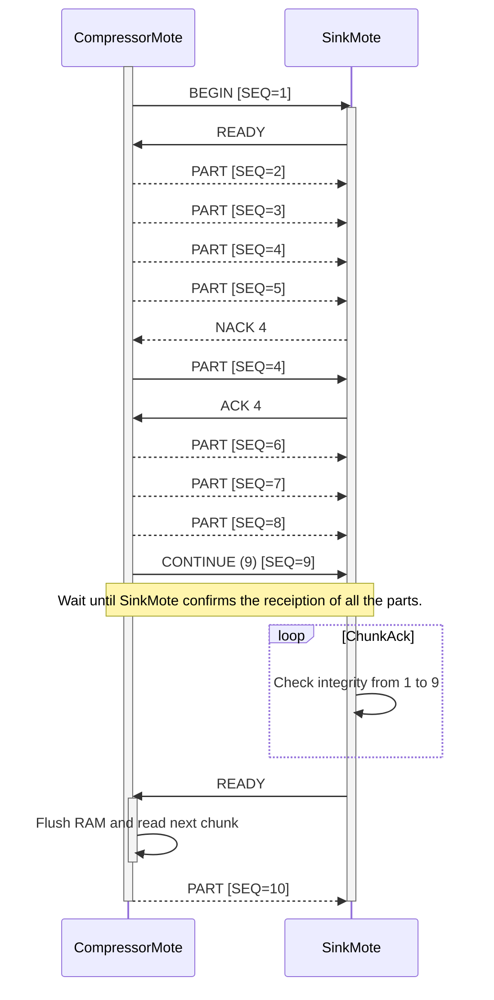

```mermaid
sequenceDiagram
	participant CompressorMote
    participant SinkMote
    activate CompressorMote
    CompressorMote->>SinkMote: BEGIN [SEQ=1]
    activate SinkMote
    SinkMote->>CompressorMote: READY
    CompressorMote-->>SinkMote: PART [SEQ=2]
    CompressorMote-->>SinkMote: PART [SEQ=3]
    CompressorMote-->>SinkMote: PART [SEQ=4]
    CompressorMote-->>SinkMote: PART [SEQ=5]
    SinkMote-->>CompressorMote: NACK 4
    CompressorMote->>SinkMote: PART [SEQ=4]
    SinkMote->>CompressorMote: ACK 4
    CompressorMote-->>SinkMote: PART [SEQ=6]
    CompressorMote-->>SinkMote: PART [SEQ=7]
    CompressorMote-->>SinkMote: PART [SEQ=8]
    CompressorMote->>SinkMote: CONTINUE (9) [SEQ=9]
    Note over CompressorMote,SinkMote: Wait until SinkMote confirms the receiption of all the parts.
    loop ChunkAck
    	SinkMote->>SinkMote: Check integrity from 1 to 9
   	end
    SinkMote->>CompressorMote: READY
    activate CompressorMote
    CompressorMote->>CompressorMote: Flush RAM and read next chunk
    deactivate CompressorMote
    CompressorMote-->>SinkMote: PART [SEQ=10]
    deactivate SinkMote
    deactivate CompressorMote
```